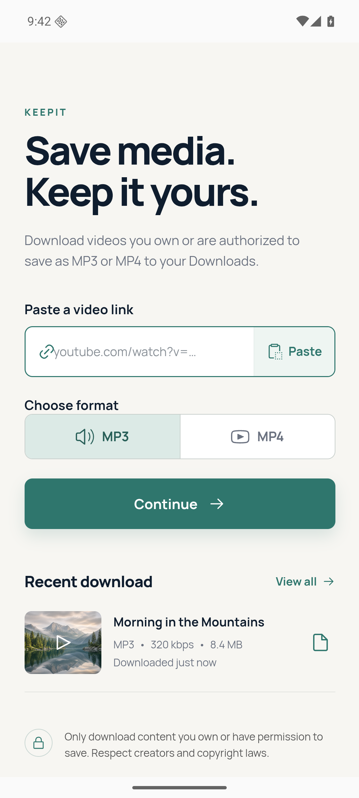
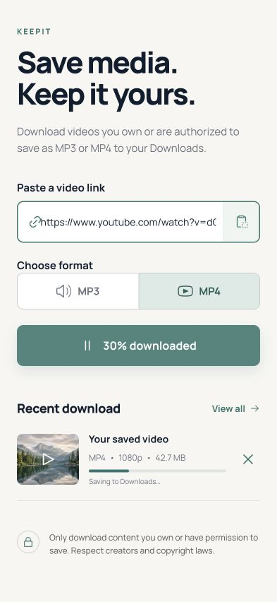
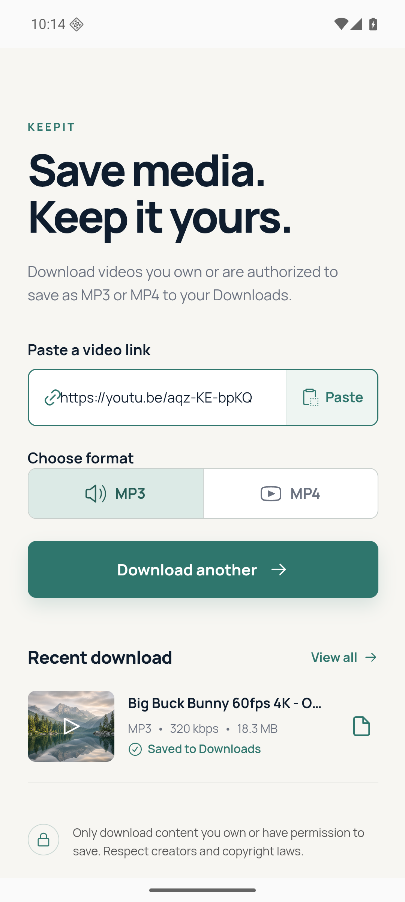

# KeepIt for Android

KeepIt is an Android media saver for downloading authorized video or audio content directly to local storage. Paste a supported link, choose MP3 or MP4, and the completed file appears in `Downloads/KeepIt`.

[Download KeepIt 1.0.0 (arm64 APK)](mobile-app/release/KeepIt-v1.0.0-arm64.apk) · [SHA-256 checksum](mobile-app/release/SHA256SUMS.txt)

## Screenshots

| Native home | Downloading | Native completion |
| --- | --- | --- |
|  |  |  |

## Features

- MP3 audio extraction with FFmpeg
- MP4 video downloads up to the best available compatible quality
- Real download progress and ETA reporting
- One-tap cancellation
- Android MediaStore integration
- Files saved to `Downloads/KeepIt`
- Daily background refresh of the media extractor for source compatibility
- No account, analytics, advertising, or remote application server
- Responsive interface designed for modern Android phones

## Requirements

- Android 10 or newer
- 64-bit ARM device (`arm64-v8a`)
- Internet connection for media retrieval

## Installation

1. Download the APK from the link above.
2. Allow your browser or file manager to install apps from this source when Android asks.
3. Open the APK and choose **Install**.

The release APK is signed with the KeepIt release certificate. Future updates must be signed with the same private key.

SHA-256:

```text
ae7f0b70093ba00934078d69f885728597b2a4f38cb08738e31286014d2897ed
```

## How it works

The application uses a React and TypeScript interface inside a Capacitor Android shell. A native Java bridge runs yt-dlp and FFmpeg on the device, then publishes the completed file through Android MediaStore. Downloads do not pass through an application-owned server.

The signed arm64 release was installed and cold-started on an Android 16 emulator. Its end-to-end MP3 path was verified with Blender Foundation's Creative Commons-licensed Big Buck Bunny test asset, producing an 18 MB file in `Downloads/KeepIt`.

```text
React interface
      │
Capacitor native bridge
      │
yt-dlp + FFmpeg
      │
Android MediaStore
      │
Downloads/KeepIt
```

## Development

Prerequisites:

- Node.js 22 or newer
- JDK 21
- Android SDK Platform 36
- Android Build Tools 36

```bash
cd mobile-app
npm ci
npm run android:debug
```

The debug APK is written to:

```text
mobile-app/android/app/build/outputs/apk/debug/app-debug.apk
```

Useful commands:

```bash
npm run dev             # Browser development preview
npm run build           # Type-check and build the web bundle
npm run android:sync    # Build and sync assets into Android
npm run android:debug   # Build an installable debug APK
npm run android:release # Build an unsigned release APK
```

## Project structure

```text
mobile-app/
├── android/                 Native Android project and download bridge
├── branding/                Launcher icon and splash artwork
├── release/                 Signed APK release
├── screenshots/             README screenshots
├── src/                     React application
│   └── native/              TypeScript native-plugin contract
└── capacitor.config.ts      Android application configuration
```

## Responsible use

Only download content you own or have explicit permission to save. You are responsible for complying with copyright law and the terms of the source service. KeepIt does not bypass DRM or access controls.

## License

Project source code is available under the [GNU GPL v3 or later](LICENSE). See [third-party notices](THIRD_PARTY_NOTICES.md) for bundled dependencies.
